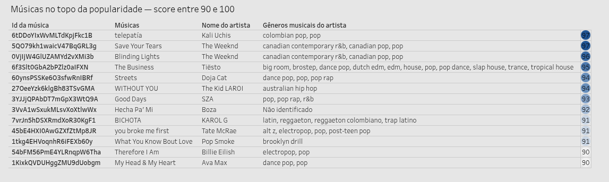
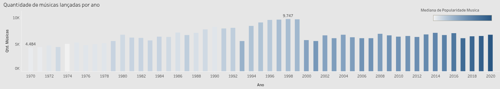

# Título do projeto: Análise de popularidade de músicas no SPOTIFY

## 💡 Resumo do projeto

Este projeto tem como o propósito analisar os índices de popularidade de músicas no Spotify, investigando padrões e tendências que possam gerar insights relevantes sobre o comportamento do consumo musical.

A proposta foi inspirada no artigo:  
🔗 https://www.rocketseat.com.br/blog/artigos/post/10-projetos-para-de-analise-de-dados

---

## 📊 Perguntas de Análise

1. Quais são as músicas mais populares em diferentes gêneros ou regiões?
2. Existe alguma correlação entre características da música (duração, energia, dançabilidade) e sua popularidade?
3. Como a popularidade de um artista evolui ao longo do tempo?

---

## 📊 Dados utilizados

O conjunto de dados utilizado para a análise é o  disponível na plataforma do Kaggle:

- Arquivos CSV: tracks.csv (111,37 MB) e artists.csv (64,89 MB).
- Descrição: mais de 600 mil faixas musicais com atributos de áudio detalhados e métricas de popularidade de mais de 1 milhão de artistas.
- Fonte: API do Spotify
- Criador: Yamac Eren Ay
- Última atualização: abril de 2021

---

## ⚙️ Etapas do projeto

### Coleta de Dados

1. Download dos arquivos CSV a partir do Kaggle  

### Armazenamento e Tratamento

2. Importação dos dados para o DBeaver  
3. Criação das tabelas no banco de dados  
4. Tratamento e limpeza dos dados utilizando MySQL  
5. Exportação da tabela final para o Google Sheets para refinamentos adicionais  
6. Estrutura da :
   - Aba 1: dados limpos das músicas (1970–2020)  
   - Aba 2: gêneros de cada artista, organizados com um gênero por linha  
7. Tratamento dos gêneros por artista utilizando 

### Scripts MySQL 

```sql

/* Criação das tabelas no banco de dados */

CREATE TABLE spotify.ARTISTS (
    id          VARCHAR(250),
    followers   FLOAT,
    genres      TEXT,
    name        TEXT,
    popularity  INT,
    CONSTRAINT ARTISTS_PK PRIMARY KEY (id)
) ENGINE = InnoDB;

CREATE TABLE spotify.TRACKS (
    id                  VARCHAR(250),
    name                TEXT,
    popularity          INT,
    duration_ms         INT,
    explicit            BOOLEAN,
    artists             TEXT,
    id_artists          TEXT,
    release_date        VARCHAR(20),
    danceability        FLOAT,
    energy              FLOAT,
    `key`               INT,
    loudness            FLOAT,
    mode                BOOLEAN,
    speechiness         FLOAT,
    acousticness        FLOAT,
    instrumentalness    FLOAT,
    liveness            FLOAT,
    valence             FLOAT,
    tempo               FLOAT,
    time_signature      INT,
    CONSTRAINT TRACKS_PK PRIMARY KEY (id)
) ENGINE = InnoDB;


/* 

Tratamento e limpeza dos dados - A consulta totalizou 340.172 registros 


**Decisões de tratamento aplicadas:**

- Relacionamento entre artistas e músicas via `INNER JOIN` pelo ID do artista
- Colunas renomeadas para o português
- Registros com valores nulos removidos
- Duplicatas de músicas removidas, mantendo o registro com a data de lançamento mais antiga
- Coluna de gêneros tratada para remover a formatação de lista (`['`, `']`, `'`)
- Artistas sem gênero identificado classificados como `Não identificado`
- Duração convertida de milissegundos para minutos
- Análise restrita ao período de **1970 a 2020** (50 anos com registros mais confiáveis)
- Músicas com mais de um artista foram excluídas devido à complexidade de tratamento dessa estrutura em SQL: a análise considera apenas um artista por música, preservando os múltiplos gêneros que cada artista pode ter.


*/

SELECT *
FROM (
    SELECT
        a.id AS id_artista,
        a.name AS nome_artista,
        CASE
            WHEN a.genres = '[]' THEN 'Não identificado'
            ELSE REPLACE(REPLACE(REPLACE(a.genres, "['", ""), "']", ""), "'", "")
        END AS generos_artista,
        a.popularity AS popularidade_artista,
        t.id AS id_musica,
        t.name AS nome_musica,
        t.popularity AS popularidade_musica,
        ROUND(t.duration_ms / 60000, 2) AS minutos_musica,
        LEFT(t.release_date, 4) AS ano_lancamento_musica,
        t.danceability AS dancabilidade_musica,
        t.energy AS energia_musica,
        ROW_NUMBER() OVER (
            PARTITION BY t.name, t.artists
            ORDER BY t.release_date ASC
        ) AS rn
    FROM spotify.ARTISTS a
    INNER JOIN spotify.TRACKS t
        ON a.id = REPLACE(REPLACE(REPLACE(t.id_artists, "['", ""), "']", ""), "'", "")
    WHERE
        a.id             IS NOT NULL
        AND a.genres     IS NOT NULL
        AND a.name       IS NOT NULL
        AND a.popularity IS NOT NULL
        AND t.id         IS NOT NULL
        AND t.name       IS NOT NULL
        AND t.popularity IS NOT NULL
        AND t.duration_ms   IS NOT NULL
        AND t.release_date  IS NOT NULL
        AND LEFT(t.release_date, 4) BETWEEN '1970' AND '2020'
        AND t.danceability IS NOT NULL
        AND t.energy       IS NOT NULL
) AS dados_limpos
WHERE rn = 1
ORDER BY popularidade_musica DESC;

```
---

## 📈 Principais Insights e Resultados

Insights obtidos durante a análise de popularidade de músicas no Spotify ao longo do ano de 2021.
Para garantir maior precisão na análise, foram aplicados os seguintes critérios de filtragem:

- **Ano de lançamento original:** apenas músicas lançadas no ano de referência foram consideradas, excluindo relançamentos e regravações
- **Autoria solo ou em grupo:** o conjunto de dados contempla exclusivamente faixas de artistas solos, bandas e grupos musicais, sem colaborações externas (featuring)

O resultado é um recorte que revela como o público do Spotify em 2021 consumia músicas lançadas entre 1970 e 2020: um panorama de 50 anos de lançamentos e sua relevância contemporânea na plataforma.

### 1. Quais são as músicas mais populares em diferentes gêneros ou regiões?

O dataset utilizado não fornecia dados de regiões, portanto essa dimensão da análise não foi possível. Considerando as músicas com score de popularidade entre 90 e 100, as faixas de destaque são:

| # | Música | Artista | Popularidade |
|---|--------|---------|:------------:|
| 1 | Telepatía | Kali Uchis | 97 |
| 2 | Save Your Tears | The Weeknd | 97 |
| 3 | Blinding Lights | The Weeknd | 96 |
| 4 | The Business | Tiësto | 95 |
| 5 | Streets | Doja Cat | 94 |
| 6 | WITHOUT YOU | The Kid LAROI | 94 |
| 7 | Good Days | SZA | 93 |
| 8 | Hecha Pa' Mí | Boza | 92 |
| 9 | BICHOTA | KAROL G | 91 |
| 10 | You Broke Me First | Tate McRae | 91 |
| 11 | What You Know Bout Love | Pop Smoke | 91 |
| 12 | Therefore I Am | Billie Eilish | 90 |
| 13 | My Head & My Heart | Ava Max | 90 |

As músicas mais populares do Spotify destacam forte presença do gênero **Pop**. A seguir, a distribuição por gênero, considerando que um artista pode ter mais de um gênero associado:

| Gênero | Músicas |
|--------|---------|
| Pop | Telepatía, Save Your Tears, Blinding Lights, The Business, Streets, Good Days, You Broke Me First, Therefore I Am, My Head & My Heart |
| Dance Pop | The Business, Streets, My Head & My Heart |
| Electropop | You Broke Me First, Therefore I Am |
| Pop Rap | Streets, Good Days |
| Canadian Contemporary R&B | Save Your Tears, Blinding Lights |
| Canadian Pop | Save Your Tears, Blinding Lights |
| Colombian Pop | Telepatía |
| Reggaeton | BICHOTA |
| Reggaeton Colombiano | BICHOTA |
| Trap Latino | BICHOTA |
| Latin | BICHOTA |
| Australian Hip Hop | WITHOUT YOU |
| Brooklyn Drill | What You Know Bout Love |
| Alt Z | You Broke Me First |
| Post-Teen Pop | You Broke Me First |
| R&B | Good Days |
| Big Room | The Business |
| Brostep | The Business |
| Dutch EDM | The Business |
| EDM | The Business |
| House | The Business |
| Slap House | The Business |
| Trance | The Business |
| Tropical House | The Business |
| Não identificado | Hecha Pa' Mí |



### 2. Existe correlação entre atributos musicais e popularidade?

Há correlações presentes, porém não significativas. É de suma importância ressaltar que **correlação não implica causalidade**: determinar o que de fato causa a alta popularidade de uma música exigiria análises mais aprofundadas, considerando múltiplos atributos musicais, questões culturais, popularidade prévia do artista, entre outros fatores.

**Energia vs. popularidade**

O gráfico evidencia uma **correlação positiva leve** entre o índice de energia da música e sua popularidade na plataforma. O índice de energia varia de 0 a 1, onde valores próximos a 1 indicam faixas de alta intensidade sonora. Apesar dessa tendência, a correlação fraca revela que músicas com baixo índice de energia também podem atingir alta popularidade, o que impossibilita afirmar, com precisão, que energia elevada é um fator determinante para o sucesso de uma faixa.

**Dançabilidade vs. popularidade**

O gráfico aponta uma **correlação positiva leve** entre o índice de dançabilidade e a popularidade da música. O índice varia de 0 a 1, onde valores próximos a 1 indicam faixas com maior apelo para a dança. No entanto, a dispersão dos dados revela que a relação não é determinística: há músicas altamente dançáveis com baixa popularidade, assim como faixas muito populares com baixo índice de dançabilidade, o que indica que a dançabilidade, por si só, não é um fator decisivo para o sucesso de uma música na plataforma.

**Duração vs. popularidade**

O gráfico evidencia uma **correlação negativa** entre a duração de uma faixa e sua popularidade na plataforma. A tendência indica que músicas mais longas tendem a registrar menores índices de popularidade. Ainda assim, a distribuição dos dados aponta exceções: algumas faixas de maior duração conseguem alcançar alta popularidade, embora representem uma parcela minoritária do conjunto analisado.


### 3. Como a popularidade de um artista evolui ao longo do tempo?

O conjunto de dados analisado contém os índices de popularidade dos artistas no momento em que os dados foram extraídos da API do Spotify (2021). Por se tratar de um projeto focado na análise do ano de 2021, foi possível obter um insight adicional sobre a evolução histórica dos lançamentos entre 1970 e 2020.

As principais observações foram:

- **1970** foi o ano com o **menor número de lançamentos**, totalizando 4.484 faixas
- **1998** foi o ano com o **maior número de lançamentos**, totalizando 9.747 faixas. Porém, apesar do alto volume, sua mediana de popularidade foi relativamente baixa (30 pontos)
- **2020** se destacou como o ano com a **maior mediana de popularidade**, com 6.800 músicas lançadas apresentando os maiores índices de popularidade no conjunto analisado

Uma hipótese para explicar o destaque de 2020 é o contexto da pandemia, período em que plataformas como o TikTok impulsionaram hits virais de forma significativa. Um exemplo representativo é *Telepatía*, de Kali Uchis, uma das músicas mais populares do conjunto (97 pontos) e que teve grande presença no TikTok no período.



---

## 🚀 Como executar o projeto

👉 [Clique aqui para acessar o dashboard interativo](https://public.tableau.com/views/AnlisedepopularidadedemsicasnoSpotify/Painel1?:language=pt-BR&:sid=&:redirect=auth&:display_count=n&:origin=viz_share_link)

Em caso de dúvidas ou sugestões, sinta-se à vontade para entrar em contato por meio da seção **Issues** deste repositório ou pelos canais disponíveis no meu perfil do GitHub.

## 🤝 Contato

[Email](cabraldorosarioanaleticia@gmail.com)

[Linkedin](https://www.linkedin.com/in/ana-let%C3%ADcia-cabral-do-ros%C3%A1rio-9a067631a/)